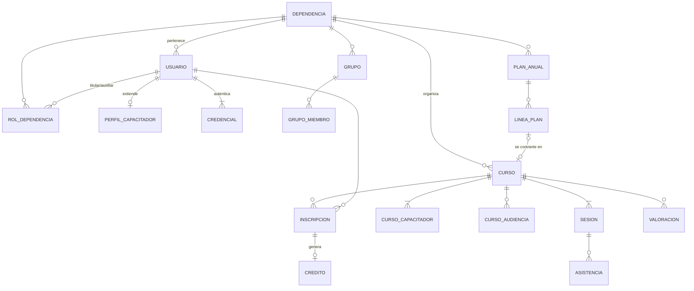

# **Instituto Digital de Capacitación · Alcance MVP**

**Versión 1.1** · 2026-09-15
Deriva de *Módulos Funcionales v4*. Ese documento se usó como guía, no como fuente de verdad.

## **1. Propósito**

Plataforma institucional para organizar e impartir cursos. Cada dependencia opera su propio espacio y puede abrir sus cursos a otras dependencias.

El MVP debe permitir recorrer **el ciclo completo de un curso**:

> planear → crear → abrir inscripción → impartir → pasar lista → evaluar → otorgar crédito → recibir valoración

**Criterio de recorte:** lo que no sea indispensable para ese recorrido queda fuera (ver §8).

Este documento es la base para escribir los PRD. Cada sección §6.x corresponde a uno o más PRD (ver §10).

---

## **2. Glosario**

| Concepto | Definición |
| :---- | :---- |
| **Dependencia** | Unidad organizativa que separa la operación en la plataforma. Tiene un titular, auxiliares, personal, cursos, grupos y un plan anual. |
| **Usuario** | Persona con cuenta. Si es *interno*, pertenece a exactamente una dependencia. Si es *externo*, no pertenece a ninguna (ver §4). |
| **Capacitador** | Usuario que tiene activo el *perfil de capacitador*. Imparte cursos y, si es interno, también puede crearlos. |
| **Curso** | Unidad que se imparte y se acredita. Pertenece a una dependencia organizadora y tiene una o más sesiones. |
| **Sesión** | Fecha y horario concretos de un curso. Un curso puede tener desde 1 sesión hasta varias semanas de sesiones. |
| **Grupo** | Lista con nombre de usuarios, creada por una dependencia. Sirve para restringir o invitar a un curso. |
| **Inscripción** | Relación entre un usuario y un curso. Registra de dónde vino (propia, asignada o por invitación), su estado y su resultado. |
| **Crédito** | 1 curso completado = 1 crédito, sin importar la duración ni la modalidad. |
| **Valoración** | Calificación de 1 a 5 que un participante le da a un curso, con comentario opcional. |
| **Plan anual** | Lista sencilla de los cursos que una dependencia prevé dar en el año. |
| **Calendario** | Vista mensual de las sesiones. Cada rol ve las que le corresponden. |
| **Ejercicio** | Año calendario. |
| **Llave BC** | Autenticador institucional de personal. **No se integra en el MVP**, pero el acceso se construye listo para conectarse después (§6.1). |

---

## **3. Roles y permisos**

Los roles **se acumulan**. Por ejemplo, una misma persona puede ser auxiliar, capacitador y participante al mismo tiempo.

| Rol | Alcance | Descripción |
| :---- | :---- | :---- |
| **Superadministrador** | Global | Da de alta las dependencias, designa titulares y consulta todo. Son pocos usuarios. |
| **Titular** | Su dependencia | Uno por dependencia. Es el administrador de su dependencia y designa a sus auxiliares. |
| **Auxiliar** | Su dependencia | Tiene los mismos permisos operativos que el titular, salvo gestionar auxiliares. |
| **Capacitador** | Cursos que imparte | Perfil adicional. Imparte cursos; si es interno, también crea cursos en su dependencia. |
| **Participante** | Lo propio | Rol base de todo usuario interno. Se inscribe, asiste, obtiene créditos y valora cursos. |

### **Matriz de permisos**

"Su dep." = sólo dentro de la dependencia a la que pertenece el usuario.

| Acción | Superadmin | Titular | Auxiliar | Capacitador | Participante |
| :---- | :----: | :----: | :----: | :----: | :----: |
| Crear, editar y desactivar dependencias | ✔ | — | — | — | — |
| Designar o cambiar titular | ✔ | — | — | — | — |
| Designar o retirar auxiliares | ✔ | ✔ su dep. | — | — | — |
| Dar de alta usuarios | ✔ | ✔ su dep. | ✔ su dep. | — | — |
| Cambiar de dependencia a un usuario | ✔ | ✔ su dep. | ✔ su dep. | — | ✔ a sí mismo |
| Activar o desactivar perfil de capacitador | ✔ | ✔ su dep. | ✔ su dep. | — | — |
| Registrar capacitadores externos | ✔ | ✔ | ✔ | — | — |
| Consultar catálogo de capacitadores | ✔ | ✔ | ✔ | ✔ | — |
| Crear y administrar grupos | consulta | ✔ su dep. | ✔ su dep. | — | — |
| Crear cursos | ✔ en cualquier dep. | ✔ su dep. | ✔ su dep. | ✔ interno, su dep. | — |
| Editar, publicar y cancelar cursos | ✔ todos | ✔ cursos de su dep. | ✔ cursos de su dep. | ✔ los que creó | — |
| Invitar o asignar participantes | ✔ | ✔ | ✔ | ✔ los que creó | — |
| Pasar lista, capturar resultados y finalizar | ✔ | ✔ cursos de su dep. | ✔ cursos de su dep. | ✔ los que imparte | — |
| Corregir resultados de un curso finalizado | ✔ | ✔ cursos de su dep. | ✔ cursos de su dep. | — | — |
| Ver el calendario | ✔ institucional | ✔ su dep. | ✔ su dep. | ✔ lo que imparte | ✔ lo propio |
| Plan anual (crear y editar) | consulta | ✔ su dep. | ✔ su dep. | — | — |
| Inscribirse, darse de baja y valorar | — | ✔ | ✔ | ✔ interno | ✔ |
| Ver créditos | todos | personal de su dep. | personal de su dep. | propios | propios |
| Ver valoraciones de un curso | todas | cursos de su dep. | cursos de su dep. | los que imparte | — |

---

## **4. Decisión de modelo: usuarios y capacitadores**

**Recomendación: una sola tabla `usuario` más una tabla de extensión `perfil_capacitador` (relación 1 a 0..1).**

| Criterio | Una tabla + extensión | Dos tablas separadas |
| :---- | :---- | :---- |
| Mover a una persona de un tipo a otro | Se activa o desactiva el perfil. El ID no cambia y no se migra nada. | Hay que copiar el registro, reasignar llaves foráneas y resolver duplicados. |
| Ser participante y capacitador a la vez | Funciona de forma natural. | Implica dos identidades y dos accesos, o sincronizarlas. |
| Autenticación | Un solo login. | Dos orígenes de login. |
| Datos propios del capacitador | Viven en la extensión, así que `usuario` no se llena de columnas vacías. | Viven en su propia tabla. |
| Historial (cursos impartidos y créditos) | Queda en el mismo ID para siempre. | Se parte entre dos registros. |

Dos tablas sólo convendrían si los capacitadores nunca iniciaran sesión, y aquí sí lo hacen.

**Reglas derivadas**

> * Desactivar el perfil pone `activo = false`, no lo borra. Así se conserva el historial de cursos impartidos.
> * **Capacitador externo:** es un `usuario` con `tipo = externo`, sin dependencia y sin número de empleado, con perfil de capacitador obligatorio. Sólo imparte: no crea cursos (todo curso debe pertenecer a una dependencia), no se inscribe y no suma créditos.
> * El catálogo de capacitadores es **global**: cualquier titular o auxiliar puede asignar a cualquier capacitador activo, sea de su dependencia o no.

---

## **5. Modelo de datos mínimo**

Sólo incluye los campos necesarios para el MVP. Todos los registros llevan `creado_en` y `actualizado_en`. En lugar de borrar, se usa `activo` o un estado.

| Entidad | Campos clave |
| :---- | :---- |
| **dependencia** | nombre, siglas, activa |
| **usuario** | nombre completo, correo (único, es el login), tipo (interno / externo), **número de empleado (obligatorio y único para los internos)**, puesto (texto), dependencia_id (obligatoria si es interno), es_superadmin, activo |
| **rol** | *No es una tabla.* El rol vive como columna de `usuario` (superadmin / titular / auxiliar / participante) junto a su `dependencia_id`. Un titular por dependencia activa lo garantiza un **índice único parcial** en la base, no la aplicación. Ver `docs/adr/0001-modelo-de-roles-y-alcance-por-dependencia.md`. |
| **perfil_capacitador** | usuario_id (**PK y a la vez FK**: garantiza un perfil por persona), especialidad (texto), institución (texto, solo para externos), semblanza breve, archivado_en. El teléfono NO se duplica: es el de `usuario`. |
| **cambio_dependencia** | usuario_id, dependencia_origen, dependencia_destino, fecha, hecho_por. Historial, sin aprobaciones ni solicitudes: el cambio ya ocurrió cuando se escribe la fila. |
| **grupo** · **grupo_miembro** | dependencia_id, nombre, descripción · grupo_id, usuario_id |
| **curso** | dependencia_id (organizadora), título, descripción, modalidad, acceso, cupo (opcional), fecha límite de inscripción (opcional), asistencia mínima % (80 por defecto), requiere_evaluacion, estado, creado_por, linea_plan_id (opcional) |
| **curso_capacitador** | curso_id, usuario_id (al menos uno por curso) |
| **curso_audiencia** | curso_id, dependencia_id **o** grupo_id (sólo cuando el acceso es restringido) |
| **sesion** | curso_id, fecha, hora de inicio, hora de fin, sede, enlace |
| **inscripcion** | curso_id, usuario_id, dependencia_id (la del usuario al inscribirse), origen (propia / asignada / invitación), estado (invitado / inscrito / rechazada / baja), resultado (pendiente / aprobado / no aprobado), nota (0–100, opcional), completado |
| **asistencia** | sesion_id, usuario_id, asistio, registrado_por, registrado_en |
| **credito** | usuario_id, curso_id, dependencia_id (la del usuario al obtenerlo), ejercicio, otorgado_en. Único por (usuario, curso). |
| **valoracion** | curso_id, usuario_id, puntuación (1–5), comentario (opcional). Única por (usuario, curso). |
| **plan_anual** | dependencia_id, ejercicio. Único por (dependencia, ejercicio). |
| **linea_plan** | plan_id, título tentativo, mes previsto, modalidad prevista, duración estimada (texto), público objetivo (texto), notas, estado (pendiente / programada / realizada / cancelada) |



---

## **6. Funcionalidades del MVP**

### **6.1 · Acceso y cuentas**

> * Inicio de sesión en la propia plataforma, con correo y contraseña.
> * Alta de usuarios por el superadmin, el titular o un auxiliar. Se le entrega una **contraseña temporal por canal privado**; el correo de activación llega con el correo transaccional (PRD-08), no antes.
> * **No hay recuperación de contraseña de autoservicio en el MVP**, porque exige correo. La restablece un administrador desde la ficha del usuario, y el diálogo genera la contraseña y la copia al portapapeles.
> * Perfil propio: datos generales, dependencia y roles.
> * Cambio de dependencia hecho por el propio usuario, sin aprobación.

**Reglas**
> * No hay autoregistro público.
> * El número de empleado es obligatorio y único para los usuarios internos. Los externos no lo tienen.
> * Un usuario inactivo no puede iniciar sesión, pero su historial se conserva.
> * El cambio de dependencia es inmediato y no requiere aprobación de nadie. Queda registrado en el historial con fecha y con quién lo hizo.
> * El titular o un auxiliar también pueden mover a un usuario de su dependencia a otra.
> * Mientras alguien sea titular no puede cambiarse de dependencia. Primero el superadmin tiene que designar a otro titular, para que ninguna dependencia se quede sin titular.
> * Al cambiar de dependencia:
>   * Se pierden los roles de auxiliar de la dependencia anterior.
>   * Las inscripciones vigentes se conservan.
>   * Los créditos y cursos previos conservan la dependencia en la que se obtuvieron.

#### **Preparación para Llave BC**

Llave BC, el autenticador institucional de personal, **no se integra en el MVP y no hay nada que construir por adelantado**. Cuando exista, la integración será una llamada a la API que provee el Ayuntamiento.

La versión anterior de este documento pedía una tabla `credencial` con proveedor e identificador externo para "dejarlo preparado". Se retiró: era estructura especulativa contra un contrato que todavía no se conoce, y habría que rehacerla igual cuando se conozca.

Lo único que sí hay que sostener desde ahora, porque cambiarlo después sí sería caro:

> * **Ningún módulo fuera de la capa de acceso valida credenciales.** Es lo que hace que añadir un segundo proveedor sea trabajo local y no una reforma.
> * La **llave de vinculación** previsible es el número de empleado, con el correo institucional como alternativa. Por eso el número de empleado es obligatorio y único para los internos desde ahora.
> * Los roles, la dependencia y los permisos **siempre los resuelve la plataforma**. De Llave BC sólo se tomaría la identidad, nunca la autorización.
> * La sesión se maneja igual venga de donde venga el inicio de sesión: la pantalla de acceso tiene que poder recibir un segundo botón sin tocar el resto de la aplicación.
> * Lo que falta para integrarla es del lado del Ayuntamiento (protocolo, credenciales de cliente, qué datos devuelve y si da de alta usuarios nuevos o sólo autentica a los que ya existen). Ver §11.

### **6.2 · Dependencias y equipo**

> * El superadmin da de alta, edita y desactiva dependencias, y designa o cambia a su titular.
> * El titular designa o retira auxiliares entre el personal de su dependencia.
> * El titular y los auxiliares consultan el directorio de personal de su dependencia.
> * El titular y los auxiliares pueden mover a un usuario de su dependencia a otra, y ven el historial de cambios de su personal.

**Reglas**
> * Exactamente un titular por dependencia activa.
> * Titular y auxiliares tienen que pertenecer a esa dependencia.
> * Una dependencia desactivada no puede crear cursos ni recibir usuarios, pero su historial se conserva.

### **6.3 · Catálogo de capacitadores**

> * Listado global con filtros por nombre, especialidad y tipo (interno o externo).
> * Activación del perfil de capacitador para un usuario interno, capturando sus datos adicionales.
> * Alta de capacitadores externos.
> * Desactivación del perfil.
> * Ficha del capacitador con cursos impartidos y valoración promedio. Ambos datos se calculan solos, sin captura. Hasta que existan las tablas de cursos (PRD-03) y valoraciones (PRD-06), la ficha los muestra con su estado vacío en vez de un cero que mentiría.

### **6.4 · Grupos**

> * Alta, edición y baja de grupos dentro de una dependencia.
> * Se agregan miembros buscando por nombre o correo. Son usuarios internos y activos **de la dependencia del grupo**.

**Reglas**
> * La pertenencia al grupo se evalúa al momento de ver el curso o inscribirse. Si alguien sale del grupo después de inscrito, su inscripción no se ve afectada.
> * Quien cambia de dependencia después de haber entrado **no se retira del grupo**: la pertenencia se evalúa al usarla, no antes. La lista lo muestra con su dependencia actual.
> * Un grupo es, por construcción, una lista de una sola dependencia. Para una audiencia mixta se usa el acceso **restringido a varias dependencias** de §6.5.

### **6.5 · Cursos y sesiones**

> * Creación del curso en borrador: título, descripción, modalidad, capacitadores, acceso y audiencia, cupo, fecha límite de inscripción, asistencia mínima y si requiere evaluación.
> * Alta, edición y eliminación de sesiones mientras el curso no esté finalizado.
> * Publicación del curso, con las validaciones de abajo.
> * Edición de un curso publicado. Si cambian sesiones, sede o enlace, se avisa a los inscritos.
> * Cancelación del curso, con aviso a los inscritos.
> * Creación de un curso a partir de una línea del plan anual, con los datos precargados (ver §6.11).

**Modalidad**

| Modalidad | Cada sesión requiere |
| :---- | :---- |
| Presencial | Sede |
| En línea | Enlace externo (Teams, Zoom, Meet, etc.). La plataforma **no aloja contenido**. |
| Híbrida | Sede y enlace |

**Acceso**

| Acceso | Quién lo ve y puede inscribirse | Casos que cubre |
| :---- | :---- | :---- |
| **Público** | Cualquier usuario interno | Curso abierto a toda la institución |
| **Restringido** | Usuarios de las dependencias y/o grupos seleccionados (al menos uno) | Exclusivo de una dependencia, de varias dependencias o de un grupo |
| **Por invitación** | Sólo los usuarios invitados | Cursos privados con lista nominal |

La dependencia organizadora, sus titulares y auxiliares y los capacitadores asignados ven siempre sus cursos, sin importar el tipo de acceso.

**Estados del curso:** `borrador` → `publicado` → `finalizado`. Desde `borrador` o `publicado` también puede pasar a `cancelado`.

**Reglas**
> * Todo curso pertenece a una dependencia organizadora. El superadmin también puede crear cursos y elige cuál lo organiza.
> * Para publicar se necesita al menos una sesión, al menos un capacitador activo, sede o enlace según la modalidad y audiencia definida si el acceso es restringido.
> * Un curso cancelado o finalizado no admite inscripciones.
> * Cancelar un curso no borra sus registros.

### **6.6 · Inscripción e invitaciones**

> * **Cursos disponibles:** muestra los cursos publicados que el usuario puede ver y que tienen la inscripción abierta.
> * **Inscripción propia:** es directa contra el cupo, sin visto bueno. Esto resuelve el punto abierto que dejaba la v4.
> * **Baja voluntaria:** permitida antes de que empiece la primera sesión.
> * **Asignación:** el titular o un auxiliar inscriben a personal de su dependencia en cualquier curso que esa dependencia pueda ver.
> * **Invitación:** el organizador invita a usuarios uno por uno o a un grupo completo (se invita a cada miembro). El invitado acepta o rechaza.
> * **Mis cursos:** próximos, en curso y finalizados, con sesiones, sede o enlace, estado y resultado.

**Reglas**
> * La inscripción cierra en la fecha límite o, si no hay una, cuando empieza la primera sesión.
> * El cupo se ocupa al inscribirse o al aceptar una invitación. Invitar no aparta lugar.
> * Si ya no hay cupo, no se puede inscribir, asignar ni aceptar.
> * Un usuario no puede tener dos inscripciones activas en el mismo curso.
> * Los usuarios externos no se inscriben.

### **6.7 · Calendario**

Vista mensual de sesiones, con cambio a vista de lista. Cada rol ve un conjunto distinto y todos comparten el mismo componente.

| Rol | Qué ve en su calendario |
| :---- | :---- |
| Participante | Las sesiones de los cursos en los que está inscrito, más las invitaciones que aún no responde, marcadas distinto |
| Capacitador | Las sesiones de los cursos que imparte |
| Titular y auxiliar | Las sesiones de los cursos organizados por su dependencia, y opcionalmente las de los cursos en los que participa su personal |
| Superadmin | Todas, con filtro por dependencia |

> * Vista mensual con navegación entre meses, y vista de lista del periodo.
> * Cada sesión muestra curso, horario y modalidad. Al abrirla se va al detalle del curso, con sede o enlace.
> * Filtros por dependencia, modalidad y capacitador, según lo que el rol pueda ver.
> * Los cursos cancelados no aparecen.
> * Quien acumula roles ve todo junto, diferenciado: lo que cursa, lo que imparte y lo que organiza su dependencia.

**Reglas**
> * El calendario no es una entidad nueva: se arma con las sesiones y las inscripciones que ya existen.
> * Sólo se ven sesiones de cursos publicados o finalizados. Los borradores aparecen únicamente para quien organiza el curso.
> * El calendario no valida traslapes ni bloquea nada. Sólo muestra (§8).

### **6.8 · Impartición: asistencia, resultados y cierre**

> * **Pase de lista por sesión:** se marca a cada inscrito como asistió o no asistió. Se puede editar hasta finalizar el curso.
> * **Captura de resultados:** sólo si el curso requiere evaluación. Se registra aprobado o no aprobado y, de forma opcional, una nota de 0 a 100.
> * **Finalizar curso:** se habilita a partir de la fecha de la última sesión. El sistema calcula quién completó, otorga los créditos, abre la valoración y marca como realizada la línea del plan vinculada.
> * **Corrección posterior:** el titular o un auxiliar pueden ajustar la asistencia o el resultado de un curso finalizado. El crédito se otorga o se retira según el nuevo cálculo y queda registrado quién hizo el cambio y cuándo.

**Cálculo de "completado"**

```
% asistencia = sesiones asistidas / total de sesiones del curso
completado   = % asistencia ≥ asistencia mínima
               Y (resultado = aprobado  O  el curso no requiere evaluación)
```

**Reglas**
> * Si el curso requiere evaluación, no se puede finalizar mientras algún inscrito tenga resultado `pendiente`.
> * Un curso de una sola sesión exige de hecho 100 % de asistencia.

### **6.9 · Créditos**

> * **Mis créditos:** total del ejercicio, acumulado histórico y lista de los cursos que los originaron.
> * **Créditos del personal:** tabla con el personal de la dependencia y sus créditos por ejercicio. La ven el titular y los auxiliares.
> * **Créditos por dependencia:** tabla resumen por ejercicio. La ve el superadmin.

**Reglas**
> * Se otorga 1 crédito por curso completado, uno solo por usuario y curso.
> * El ejercicio del crédito es el año de la última sesión del curso.
> * El crédito guarda la dependencia a la que pertenecía el usuario al obtenerlo. Si después se cambia, el crédito sigue contando para la dependencia anterior.

### **6.10 · Valoración del curso**

> * Cuando el curso se finaliza, cada inscrito que asistió al menos a una sesión puede valorarlo de 1 a 5 y dejar un comentario opcional.
> * El detalle del curso muestra el promedio y el número de valoraciones a la dependencia organizadora y a los capacitadores. La ficha del capacitador muestra su promedio general.

**Reglas**
> * Una sola valoración por usuario y curso, y no se puede editar.
> * Los comentarios se muestran sin nombre. El sistema guarda internamente al autor para impedir duplicados.

### **6.11 · Plan anual**

Es una herramienta de planeación propia de cada dependencia. **No pasa por aprobaciones.** Tiene que funcionar igual para una dependencia que da un solo curso al año que para una que da veinte.

> * Se crea un plan por dependencia y ejercicio cuando se necesita.
> * Cada línea lleva título tentativo, mes previsto, modalidad prevista, duración estimada en texto libre ("1 sesión", "3 semanas"), público objetivo en texto libre y notas.
> * Hay dos vistas: lista y agrupada por mes, para ver cómo se reparte el año.
> * La acción **"Crear curso desde esta línea"** abre un curso en borrador con título y modalidad precargados y lo vincula a la línea.
> * La línea puede cancelarse manualmente.
> * El plan muestra un indicador de avance: `realizadas / (total − canceladas)`.

**Estado de la línea**

| Estado | Cuándo |
| :---- | :---- |
| `pendiente` | Estado inicial. También si el curso vinculado se cancela. |
| `programada` | Tiene un curso vinculado en borrador o publicado. |
| `realizada` | Su curso vinculado se finalizó. Es automático. |
| `cancelada` | Se canceló manualmente. |

**Reglas**
> * Cada línea se vincula como máximo a un curso. Si un curso se repite, se agregan más líneas.
> * Un curso puede existir sin línea de plan: el plan orienta, no restringe.
> * Los planes de ejercicios anteriores quedan en sólo lectura.
> * Lo consultan el superadmin, el titular y los auxiliares de la dependencia.

### **6.12 · Notificaciones mínimas (correo)**

Plantillas fijas y envío asíncrono. Si falla el correo, no se bloquea ninguna operación.

| Evento | Destinatario |
| :---- | :---- |
| Activación de cuenta y recuperación de contraseña | Usuario |
| Invitación a un curso | Invitado |
| Inscripción confirmada o asignación | Participante |
| Cambio de sesiones, sede o enlace, o cancelación del curso | Inscritos |
| Cambio de dependencia aplicado por un administrador | Usuario movido |

---

## **7. Criterios de aceptación del MVP**

> 1. Se puede completar el recorrido de demostración (§9) de principio a fin sin tocar la base de datos a mano.
> 2. Cada rol ve y hace exactamente lo que marca la matriz de §3, y nada fuera de su dependencia salvo lo que dan el acceso público, restringido o por invitación.
> 3. Un curso restringido o por invitación no aparece, ni por listado ni por URL directa, a quien no tiene acceso.
> 4. Al finalizar un curso, los créditos se otorgan solos y coinciden con la fórmula de §6.8.
> 5. Un usuario que cambia de dependencia conserva sus créditos, y esos créditos siguen contando para la dependencia donde los obtuvo.
> 6. Una línea del plan pasa de `pendiente` a `programada` y luego a `realizada` sin que nadie la actualice a mano.
> 7. Al inscribirse a un curso, sus sesiones aparecen en el calendario del participante sin ningún paso adicional.
> 8. **Ningún módulo fuera de `auth` valida credenciales.** Es la propiedad que de verdad hay que sostener, y la que hace que agregar Llave BC más adelante sea trabajo dentro de la capa de acceso.

---

## **8. Qué se quitó respecto a la v4**

| Concepto de la v4 | ¿Entra al MVP? | Reemplazo o motivo |
| :---- | :---- | :---- |
| Importación y conciliación de la plantilla desde CSV/XLSX (M1) | No | Alta manual de usuarios |
| Unidades administrativas | No | Sólo dependencia |
| CURP/RFC, fecha de ingreso, bitácora de adscripciones | No | Las inscripciones y los créditos guardan la dependencia de ese momento |
| Catálogo de temas y áreas temáticas, vigencias (M2) | No | Título libre en el curso y en la línea del plan |
| Créditos variables por tema | No | 1 curso = 1 crédito |
| Plan por responsable o capacitador, duplicar el ejercicio anterior, exportar a PDF/XLSX (M3) | No | Plan sencillo por dependencia |
| Convocatorias con texto y requisitos (M4) | No | Descripción del curso |
| Habilitación mensual del calendario | No | Publicado = visible |
| Vista de calendario mensual | **Sí** | Módulo de calendario por rol (§6.7) |
| Validación de traslapes de horario | No | Queda para una fase posterior |
| Visto bueno del titular para inscribirse | No | Inscripción directa contra cupo |
| Plantillas de correo editables, bitácora de envíos, recordatorios (M5) | No | Correos fijos mínimos (§6.12) |
| Cuestionario de evaluación en línea (M6) | No | El capacitador captura aprobado o no aprobado y una nota opcional |
| Asistencia por QR con ventana de vigencia | No | Pase de lista manual |
| Bitácora de ajustes con motivo | Parcial | Se registra quién hizo el cambio y cuándo |
| Constancias y diplomas en PDF con folio y QR, verificación pública (M7) | No | Confirmado fuera del MVP. Primer candidato para la fase 2 |
| Autenticación con Llave BC | No | Se deja preparada la capa de acceso para conectarla después (§6.1) |
| Expediente digital consolidado | Parcial | "Mis cursos" y "Mis créditos" |
| Porcentaje de cumplimiento contra el PAC asignado (M8) | No | Conteo de créditos |
| Tableros, gráficas, comparativos y reportes exportables | No | Tablas simples de créditos |
| Roles Titular de Área y Dependencia (consulta) | No | Titular y auxiliar de dependencia |
| "Los capacitadores no tienen catálogo propio" | Ajustado | Misma tabla más extensión de perfil, con vista de catálogo global (§4) |
| Contenido de cursos alojado (LMS) | No | Enlace externo |
| DNC, banco de firmas | No | Ya estaban fuera en la v4 |

---

## **9. Recorrido de demostración**

1. El **superadmin** crea las dependencias A y B y designa a sus titulares.
2. El **titular de A** designa a un auxiliar, da de alta a varios usuarios, activa el perfil de capacitador de uno de ellos y registra a un capacitador externo.
3. El **auxiliar de A** crea el plan anual 2026 con dos líneas.
4. A partir de la primera línea crea un curso **híbrido y restringido a A y B**, con 3 sesiones, cupo de 20 y evaluación.
5. El **capacitador interno** crea un segundo curso, **por invitación**, e invita a un grupo.
6. Un usuario de **B** se inscribe al primer curso. Un miembro del grupo acepta la invitación al segundo.
7. Ese usuario ve las 3 sesiones en **su calendario**, y el capacitador ve en el suyo los dos cursos que imparte.
8. El capacitador pasa lista en las 3 sesiones, captura los resultados y finaliza el curso.
9. Los participantes ven su crédito y valoran el curso.
10. La línea del plan aparece como **realizada**. El titular de A ve los créditos de su personal y el capacitador ve su valoración promedio.
11. Un usuario de A se cambia a B por su cuenta, sin aprobación. Su crédito sigue contando para A.

---

## **10. PRD sugeridos**

| PRD | Contenido | Depende de |
| :---- | :---- | :---- |
| PRD-01 · Cuentas, dependencias y roles | §6.1, §6.2 | — |
| PRD-02 · Capacitadores y grupos | §4, §6.3, §6.4 | PRD-01 |
| PRD-03 · Cursos, sesiones y acceso | §6.5 | PRD-02 |
| PRD-04 · Inscripción e invitaciones | §6.6 | PRD-03 |
| PRD-05 · Calendario | §6.7 | PRD-04 |
| PRD-06 · Impartición, créditos y valoración | §6.8, §6.9, §6.10 | PRD-04 |
| PRD-07 · Plan anual | §6.11 | PRD-03 |
| PRD-08 · Notificaciones mínimas | §6.12 | Transversal: se implementa junto con cada PRD |

---

## **11. Supuestos y puntos abiertos**

**Decisiones confirmadas**

> * El número de empleado es obligatorio para los usuarios internos.
> * El superadmin puede crear cursos. Elige qué dependencia los organiza, así que todo curso sigue perteneciendo a una.
> * Las constancias en PDF quedan fuera del MVP.
> * El inicio de sesión es de la propia plataforma, construido para conectarse después con **Llave BC**.
> * El cambio de dependencia no requiere aprobación.
> * El calendario entra al MVP.

**Supuestos adoptados en este documento (validar)**

> * Los capacitadores externos no crean cursos, no se inscriben y no suman créditos.
> * La asistencia mínima es de 80 % por defecto y se puede ajustar en cada curso.
> * El ejercicio es el año calendario, y el crédito cuenta en el año de la última sesión del curso.
> * Las valoraciones son anónimas para todos los roles.
> * La relación entre línea del plan y curso es de 1 a 1.
> * El titular de una dependencia ve el historial completo de un usuario que llega transferido.
> * Como el cambio de dependencia es libre, alguien podría cambiarse para alcanzar un curso restringido. Se asume aceptable: el cambio queda registrado y el titular lo ve.

**Puntos abiertos**

> * **Llave BC:** ¿qué protocolo usa (OAuth2/OIDC, SAML, API propia con token)? ¿Qué datos devuelve? ¿Sólo autentica a quien ya existe en la plataforma o también da de alta usuarios nuevos? ¿Convive con el acceso local o lo sustituye por completo? Nada de esto bloquea el MVP, pero define el trabajo de la integración.
> * ¿El calendario necesita exportarse o suscribirse desde Outlook o Google Calendar? Hoy está fuera.
