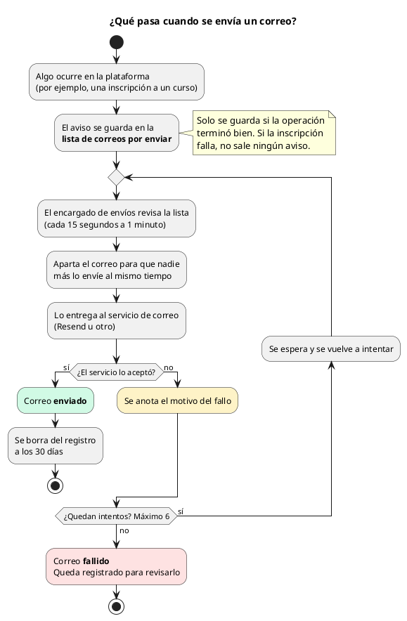
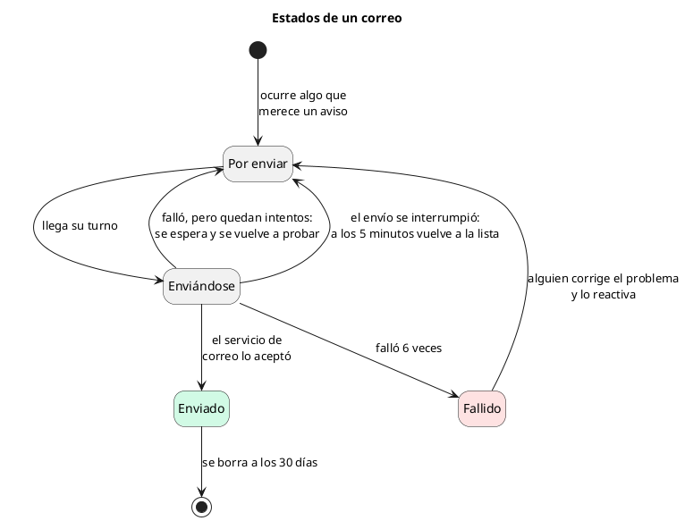
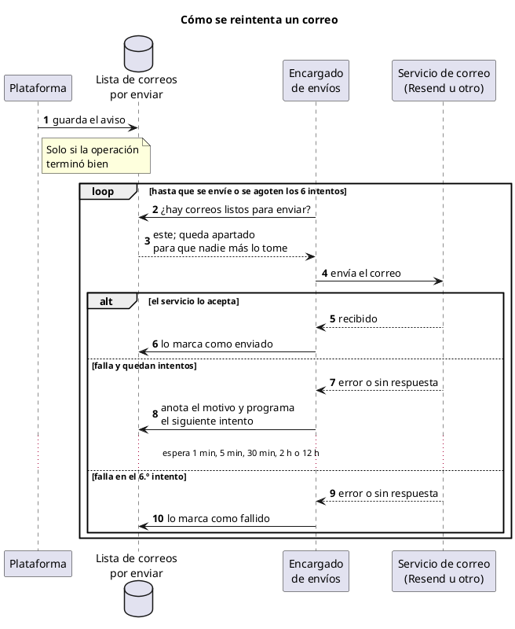

# Notificaciones por correo — Referencia

## 1. Qué es

`app/modules/notifications/` entrega §6.12 del alcance: avisos fijos por correo,
enviados de forma asíncrona sin bloquear ninguna operación. El transporte vive en
`app/shared/mail/`. Las decisiones están en
[ADR 0008](../adr/0008-notificaciones-outbox-transaccional.md).

## 2. Eventos

| Plantilla | Destinatario | Lo encola | Cuándo |
| --- | --- | --- | --- |
| `ACCOUNT_CREATED` | Cuenta nueva | `users#create`, `trainers#createExternal` | Siempre. **Sin contraseña** |
| `PASSWORD_RESET` | La cuenta | `users#resetPassword` | Siempre. Sin la contraseña |
| `DEPENDENCY_CHANGED` | Cuenta movida | `users#changeDependency` | Siempre que la dependencia cambió (el traslado lo hace otra persona) |
| `COURSE_INVITATION` | Cada invitado | `enrollments#invite` | Solo los invitados del lote, no los omitidos |
| `ENROLLMENT_CONFIRMED` | La persona | `enrollments#enroll`, `#accept` | — |
| `ENROLLMENT_ASSIGNED` | Cada asignado | `enrollments#assign` | — |
| `COURSE_UPDATED` | `ENROLLED` + `INVITED` activos | `courses#update` | Curso publicado y `hasScheduleChanges` |
| `COURSE_CANCELLED` | `ENROLLED` + `INVITED` activos | `courses#cancel` | Solo si estaba publicado |
| `CERTIFICATE_ISSUED` | Cada persona con emisión **nueva** | `certificateIssuance#sync` (dentro de `completionSync`) | Al emitirse por primera vez. Restaurar o revocar no avisa. Lleva el mensaje del curso (`email_message`) y, con la descarga apagada, dice que la dependencia lo entrega |

`hasScheduleChanges` avisa si se añade o quita una sesión, o si cambia su
horario, su sede o su enlace. Editar título, descripción, cupo o audiencia no
avisa.

`CERTIFICATE_ISSUED` se encola en la misma transacción que escribe la emisión:
- al finalizar un curso;
- al completar un autogestivo;
- al pulsar «Emitir certificados».

Si la emisión revierte, el correo no sale
([02-emision.md](../certificates/02-emision.md) §9).

## 3. Ciclo de vida de un mensaje

```
caso de uso ── runInTransaction ───────────────────────────────┐
  escritura principal                                          │
  notificationService.notify(events)                           │
    renderNotification → email_outbox (PENDING, attempts 0)    │
  commit ◀─────────────────────────────────────────────────────┘
                     │
                     │  sin REDIS_URL: poller del web (cada 15 s)
                     │    claimDue: FOR UPDATE SKIP LOCKED
                     │  con REDIS_URL: tras el commit, trabajo deliver-email
                     │    (jobId outbox-<id>-<intento>) en el worker de colas;
                     ▼    claimById: UPDATE condicional por id
  reserva: locked_until = +5 min, attempts + 1
  mailer.send
    ok     → SENT (sent_at)                    → purga a los 30 días
    falla  → PENDING, next_attempt_at = +1 m / 5 m / 30 m / 2 h / 12 h
    falla tras el reintento de 12 h → FAILED (last_error)
```

**Con Redis**, el horario de reintentos sigue siendo el de la fila: el trabajo va
con un solo intento, y un barrido cada 60 s (`sweep-outbox`) vuelve a encolar lo
vencido, sea un reintento cuyo horario llegó, un correo que no alcanzó la cola o
una reserva de un worker caído. La purga de enviados pasa a un trabajo diario. El
web **no** sondea el outbox, así que el worker es obligatorio
([queues/00-colas.md](../queues/00-colas.md), [ADR 0033](../adr/0033-colas-bullmq-sobre-el-outbox.md)).

### Reintentos

Si un correo no sale a la primera, el sistema lo vuelve a intentar solo, con
esperas cada vez más largas. Así, una caída breve del servicio de correo no hace
que se pierdan avisos.







| Intento | Espera desde el anterior | Tiempo desde el primero |
| --- | --- | --- |
| 1 | — | 0 |
| 2 | 1 min | 1 min |
| 3 | 5 min | 6 min |
| 4 | 30 min | 36 min |
| 5 | 2 h | 2 h 36 min |
| 6 | 12 h | 14 h 36 min |

- Si el sexto intento falla, el correo queda como fallido. No se pierde: queda
  registrado con el motivo y se puede reactivar (§5).
- Cada correo se reintenta por su cuenta: uno que falla no frena a los demás.
- Si el envío se interrumpe a la mitad (por ejemplo, porque se reinició el
  servidor), el correo vuelve a la lista a los 5 minutos. Ese intento cuenta
  como uno de los seis.

## 4. Configuración

| Variable | Por defecto | Qué hace |
| --- | --- | --- |
| `SMTP_HOST` | — | Sin ella, el adaptador de log sustituye al SMTP |
| `SMTP_PORT` | 587 | |
| `SMTP_SECURE` | `false` | `true` para el puerto 465 |
| `SMTP_USER`, `SMTP_PASSWORD` | — | Autenticación, si el servidor la pide |
| `MAIL_FROM` | — | Remitente. Obligatorio con `SMTP_HOST` |
| `APP_BASE_URL` | `RAILWAY_PUBLIC_DOMAIN`, si lo hay | Origen de los enlaces, sin barra final. Obligatorio con `SMTP_HOST`; `https` en producción. En Railway se deriva del dominio público del servicio, y solo se declara con dominio propio |
| `EMAIL_WORKER_ENABLED` | Sí, salvo en `test` | `false` para un proceso que no debe enviar. Solo aplica sin `REDIS_URL` |
| `EMAIL_WORKER_INTERVAL_S` | 15 | Periodo del poller sin Redis |
| `QUEUE_EMAIL_CONCURRENCY` | 5 | Correos en paralelo por worker de colas, con Redis |

**Desarrollo con Mailpit:** `docker compose up -d mailpit`, luego `SMTP_HOST=127.0.0.1`
(con `localhost`, si WSL reenvía también el puerto 1025 por IPv6, el correo puede
acabar en otro servidor),
`SMTP_PORT=1025`, `MAIL_FROM` y `APP_BASE_URL`. La bandeja queda en
`http://localhost:8025`.

## 5. Diagnóstico

```sql
-- Pendientes y reintentos
SELECT id, template, recipient, attempts, next_attempt_at, last_error
FROM org.email_outbox WHERE status = 'PENDING' ORDER BY id;

-- Fallidos definitivos
SELECT id, template, recipient, attempts, last_error
FROM org.email_outbox WHERE status = 'FAILED' ORDER BY id DESC;

-- Reintentar un fallido tras corregir la configuración
UPDATE org.email_outbox
SET status = 'PENDING', attempts = 0, next_attempt_at = now(), locked_until = NULL
WHERE id = <id>;
```

El log registra `email outbox drained` cuando una pasada hizo algo y `email
delivery failed permanently` para cada `FAILED`. El adaptador de log escribe
destinatario y asunto, nunca el cuerpo.

## 6. Amenazas → defensas

| Amenaza | Defensa |
| --- | --- |
| Se avisa de una inscripción que se revirtió por falta de cupo | El aviso se encola dentro de la transacción de la inscripción |
| Un reinicio pierde el aviso de una cancelación | La cola está en la base, no en memoria |
| Dos réplicas envían el mismo correo | `FOR UPDATE SKIP LOCKED` y `locked_until` |
| El SMTP cae y las inscripciones empiezan a fallar | El envío ocurre fuera de la petición |
| Una contraseña viaja por correo | Ninguna plantilla la recibe; pruebas en `users`, `trainers` y plantillas |
| Un título de curso con HTML inyecta contenido | `escapeHtml` en toda plantilla HTML |
| Un correo con datos personales acaba en los logs | El adaptador de log solo registra destinatario y asunto |
| Un correo mal formado se reintenta para siempre | `isDeliverable` lo descarta al encolar; los reintentos tienen tope |
| La cola crece sin límite | Purga de `SENT` a los 30 días |

## 7. Añadir una plantilla

1. Añade la variante a `NotificationEvent` y el nombre a `NOTIFICATION_TEMPLATES`.
2. Añade su `case` en `renderNotification`. El `never` del `default` señala si falta.
3. Encola desde el caso de uso **dentro** de su `runInTransaction`, con los datos
   que ya tiene en mano.
4. Prueba la plantilla (asunto, escape, sin credenciales) y el enganche (se encola
   dentro de la transacción y no se encola si la operación falla).
