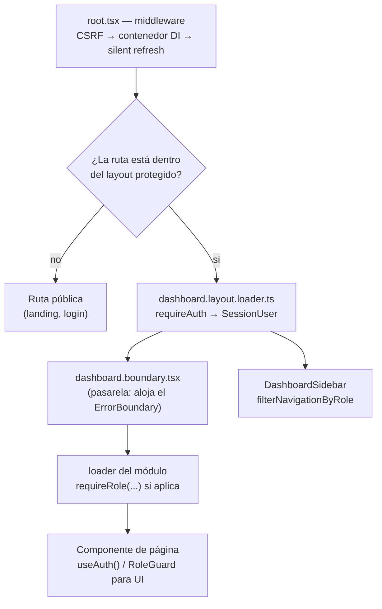

# Sistema de enrutado y autorización de presentación — Referencia de punta a punta

**Última actualización:** 2026-07-25 · Este documento describe el sistema **como
está implementado**. Registra el *qué* y el *cómo* de la capa de rutas: cómo se
compone el árbol, dónde vive el gate de autenticación, cómo se responde a un
fallo de autorización y qué piezas de UI derivan del rol.

Complementa a [auth/00-sistema-autenticacion.md](../auth/00-sistema-autenticacion.md),
que documenta *quién es el usuario*. Este documenta *a dónde puede llegar y qué ve*.

---

## 1. Visión general

Enrutado sobre **React Router v7 en framework mode** con `future.v8_middleware`.
Cuatro ideas gobiernan el diseño:

| Idea | Consecuencia |
|---|---|
| **El árbol de rutas se declara, no se deriva del filesystem** | `app/routes.ts` compone arrays que cada módulo exporta desde su `routes.config.ts` |
| **El gate de autenticación es estructural** | Lo protegido es lo que está dentro del `layout()` de la zona protegida — no una lista de rutas públicas que pueda desincronizarse |
| **La autorización responde con el status real** | Sin el rol → **403**, no un redirect que mienta sobre lo ocurrido |
| **La UI por rol es solo UX** | La navegación filtrada y los guards de cliente nunca son la barrera de seguridad |

Los roles se editan en **un solo lugar** (`shared/rules/atoms.rules.ts`), y ese
único punto alimenta el guard de servidor, la config de navegación y los guards
de UI.

## 2. Estructura y responsabilidades

```
app/
├── routes.ts                          ← árbol de rutas en TRES ZONAS (§3)
├── root.tsx                           middleware global + ErrorBoundary raíz
├── shared/
│   ├── auth/
│   │   ├── require-auth.server.ts     guard de autenticación (lee authPayload)
│   │   ├── require-role.server.ts     ← ÚNICO punto de decisión por rol (§5)
│   │   └── session-user.ts            SessionUser: proyección client-safe
│   ├── http/
│   │   └── route-error.ts             HTTP_STATUS + detectores TIPADOS (§6)
│   ├── rules/atoms.rules.ts           ROLES + Role + hasRole
│   ├── layout/
│   │   ├── layout.constants.ts        DASHBOARD_LAYOUT_ID (cero imports)
│   │   ├── layout.types.ts            DashboardLayoutData (contrato loader↔hook)
│   │   ├── navigation.types.ts        NavItem
│   │   ├── navigation.config.ts       navigationConfig — declarativa, tipada por Role
│   │   ├── navigation.utils.ts        filterNavigationByRole — pura, testeable
│   │   ├── components/
│   │   │   ├── dashboard-sidebar.tsx  Sidebar shadcn + nav filtrada
│   │   │   └── dashboard-user-menu.tsx Avatar + menú + logout
│   │   └── routes/
│   │       ├── dashboard.layout.tsx        shell (SidebarProvider + Outlet)
│   │       ├── dashboard.layout.loader.ts  requireAuth → SessionUser
│   │       └── dashboard.boundary.tsx      ← pasarela que aloja el ErrorBoundary (§7)
│   ├── hooks/
│   │   ├── use-auth.ts                useAuth / useOptionalAuth
│   │   └── use-role.ts                useRole
│   └── components/
│       ├── auth/role-guard.tsx        <RoleGuard>
│       └── errors/route-error-view.tsx vista 401/403/404 compartida
└── modules/<modulo>/routes/
    ├── routes.config.ts               porción del árbol que aporta el módulo
    └── <segmento>/
        ├── index.tsx                  componente + re-export de loader/action
        ├── index.loader.ts            loader (datos + guard de rol)
        └── index.action.ts            action (mutaciones)
```

El shell vive en `shared/layout/` y **no** en un módulo: es presentación
transversal sin dominio, puertos ni servicio, así que no cumple la taxonomía de
módulo de [reglas-base §21](../reglas-base-proyecto-agnostico.md). El precedente
es `shared/storage/` (`routes.config.ts` + `routes/`). La *página* home del
dashboard sí es un módulo (`modules/dashboard/`), igual que `modules/home/`.

## 3. El árbol de rutas: tres zonas

`app/routes.ts` está dividido en zonas explícitas y comentadas, no en una lista
plana:

```ts
export default [
  // ZONA 1 — Público / landing (sin sesión)
  ...homeRoutes,
  ...authRoutes,

  // ZONA 2 — Dashboard protegido (/dashboard/*)
  layout("shared/layout/routes/dashboard.layout.tsx", { id: DASHBOARD_LAYOUT_ID }, [
    layout("shared/layout/routes/dashboard.boundary.tsx", [
      ...prefix("dashboard", [
        ...dashboardRoutes,   // /dashboard
        ...usersRoutes,       // /dashboard/usuarios  (ADMIN)
        ...authAdminRoutes,   // /dashboard/sesiones  (ADMIN)
      ]),
    ]),
  ]),

  // Infraestructura — resource routes sin UI
  ...storageRoutes,
] satisfies RouteConfig;
```

Puntos de diseño:

- **`layout()` no añade segmento a la URL**; `prefix()` sí. `prefix` va *dentro*
  de `layout` para que el shell pueda envolver en el futuro rutas protegidas que
  no cuelguen de `/dashboard`.
- **Mover una zona es mover un spread.** Si una superficie pública pasa a exigir
  sesión, su spread se traslada de la ZONA 1 a la ZONA 2 y el módulo no cambia ni
  una línea.
- **Un módulo se añade tocando dos sitios**: su `routes.config.ts` y un spread en
  la zona correcta.
- No se crean archivos vacíos "de reserva" para zonas futuras. El repo arrastró
  siete archivos de ruta de 0 bytes precisamente por esa práctica; los marcadores
  de zona comentados cumplen la misma función sin código muerto.

### 3.1 Convención por módulo

```ts
// app/modules/<modulo>/routes/routes.config.ts
import { type RouteConfigEntry, route } from "@react-router/dev/routes";

/** Gestión de usuarios — solo ADMIN (impuesto en index.loader.ts). */
export const usersRoutes = [
  route("usuarios", "modules/users/routes/usuarios/index.tsx"),
] satisfies RouteConfigEntry[];
```

El `satisfies RouteConfigEntry[]` no es decorativo: sin él, un array mal formado
solo falla al componerlo en `routes.ts`, lejos de su origen.

### 3.2 Imports de `+types`

Typegen emite los tipos en
`<dir>/+types/<basename-del-archivo-registrado-en-routes.config>.ts` — el nombre
sale del archivo **registrado como módulo de ruta**, no del archivo que importa.

| Archivo | Import correcto |
|---|---|
| `usuarios/index.loader.ts` (el módulo de ruta es `index.tsx`) | `./+types/index` |
| `cerrar-sesion/index.action.ts` (es él mismo el módulo de ruta) | `./+types/index.action` |
| `dashboard.layout.loader.ts` (el módulo es `dashboard.layout.tsx`) | `./+types/dashboard.layout` |

La forma `./+types/` (barra final, sin basename) resuelve **solo** por
`moduleResolution: "bundler"` y se rompería al pasar a `node16`/`nodenext`. Está
prohibida.

## 4. Capas y ciclo de una petición



1. **`root.tsx` — middleware.** Sin cambios respecto a
   [auth/00 §5](../auth/00-sistema-autenticacion.md#5-ciclo-de-vida-de-una-petición):
   CSRF por `Origin` → contenedor DI por petición → silent refresh → `next()` →
   anexa `Set-Cookie`. **No** contiene ninguna lista de rutas públicas ni lógica
   de protección.
2. **Layout de zona protegida.** Su loader llama `requireAuth`. Al colgar de él
   toda la zona, una ruta nueva queda protegida **por construcción**.
3. **Loader del módulo.** Añade el filtro de **rol específico** del recurso.
4. **Componente.** Consume identidad por hook; nunca vuelve a pedirla al servidor.

> **Esto NO son tres verificaciones de sesión.** El middleware es el único que
> verifica: valida el JWT y, si hace falta, lo refresca. `requireAuth` en el
> layout es una lectura **O(1) en memoria** de `context.authPayload` que no toca
> la base de datos. No conviertas esa lectura en una verificación "de verdad" ni
> la elimines por parecer redundante.

## 5. Autorización por rol

### 5.1 Fuente única

```ts
// app/shared/rules/atoms.rules.ts
export const ROLES = ["USER", "ADMIN"] as const;
export type Role = (typeof ROLES)[number];

export function hasRole(role: Role, allowed: readonly Role[]): boolean {
  return allowed.includes(role);
}
```

El valor de `hasRole` no es su lógica —es un `includes`— sino el **vocabulario**:
al tipar `allowed` como `readonly Role[]`, un rol inexistente falla en
compilación simultáneamente en el guard de servidor, la config de navegación y
los guards de UI.

**No hay jerarquía de roles** (`isAdmin`, `canManageRole`) y es deliberado:
nombrar un rol concreto en código compartido rompe el contrato de "cada proyecto
derivado edita solo esta tupla". Un proyecto que declare
`ROLES = ["CLIENTE", "ASESOR", "GERENTE"]` dejaría un `isAdmin` colgando de un
literal inexistente. Cuando exista CRUD de usuarios con jerarquía real, vivirá en
`modules/users/domain/`, no en `shared/`.

### 5.2 Guard de servidor

```ts
export async function requireRole(
  request: Request,
  context: ICradle,
  roles: readonly Role[],
  options?: { redirectTo?: string },
): Promise<AuthContext> {
  const auth = await requireAuth(request, context);

  if (hasRole(auth.role, roles)) return auth;
  if (options?.redirectTo) throw redirect(options.redirectTo);

  throw data<ForbiddenRoleData>(
    { code: FORBIDDEN_ROLE_CODE, requiredRoles: roles },
    { status: HTTP_STATUS.FORBIDDEN, statusText: "Forbidden" },
  );
}
```

**Por qué 403 y no un redirect:** un 403 dice la verdad —el recurso existe, la
sesión es válida, falta permiso— y **conserva la URL intentada**. Un redirect
convertiría el fallo en un `302 + 200`, perdería la URL y ocultaría el problema
tanto al usuario como a los tests. `options.redirectTo` sigue disponible como
escotilla **opt-in** para flujos que sí quieran reencaminar (p. ej. onboarding
incompleto); antes era el comportamiento por defecto.

> ⚠️ **`statusText: "Forbidden"` es obligatorio.** Al convertir un `data()`
> lanzado en `ErrorResponse`, React Router usa `"Internal Server Error"` por
> defecto (`dataWithResponseInitToErrorResponse`). Sin ese literal explícito, un
> 403 se muestra al usuario como un error interno.

Uso típico, como primera línea del loader:

```ts
export const loader = async ({ request, context }: Route.LoaderArgs) => {
  // 🔒 Solo ADMIN — un rol insuficiente produce un 403 real (no un redirect).
  const auth = await requireRole(request, context, ["ADMIN"]);
  return { auth };
};
```

### 5.3 Las cuatro capas y cuál es seguridad

| Capa | Dónde corre | Qué decide | ¿Seguridad real? |
|---|---|---|---|
| 1. Middleware de `root.tsx` | Servidor, antes de todo loader | ¿Hay sesión válida? ¿Hay que refrescar? | **Sí** (autenticación) |
| 2. Loader del layout (`requireAuth`) | Servidor, al entrar a la zona | ¿Puede entrar a la zona protegida? | **Sí** (gate estructural) |
| 3. `requireRole` en el loader | Servidor, dentro de la ruta | ¿El rol alcanza a *este* recurso? | **Sí** (autorización) |
| 4. `filterNavigationByRole` / `useRole` / `<RoleGuard>` | Cliente | ¿Se muestra el enlace / el botón? | **No — solo UX** |

Un usuario que teclee directamente una URL que no ve en el menú **sigue
recibiendo un 403**: la capa 4 solo evita ofrecer accesos que fallarían.

## 6. Detección de errores tipada

`shared/http/route-error.ts` centraliza la clasificación:

```ts
export function isForbiddenError(error: unknown): error is ErrorResponse {
  return isRouteErrorResponse(error) && error.status === HTTP_STATUS.FORBIDDEN;
}
```

Todos los detectores (`isUnauthorizedError`, `isForbiddenError`,
`isNotFoundError`) se apoyan **exclusivamente en el `status` tipado** de
`ErrorResponse`. **Nunca** en el texto del mensaje ni en la forma de un error de
API serializado: olfatear strings es frágil y este proyecto ya tiene errores de
dominio tipados con `code`.

`isForbiddenRoleError` estrecha un 403 genérico al 403 concreto de `requireRole`
comprobando `error.data.code === FORBIDDEN_ROLE_CODE`. Sirve para que la vista
distinga "te falta el rol X" de cualquier otro 403 que un loader pudiera lanzar.

**Lo que NO existe, y es intencional:** no hay wrappers tipo
`withAuthErrorHandler` / `withStreamAuthErrorHandler`. Esos patrones existen para
capturar 401 que surgen *a mitad* de un loader al llamar a una API externa. Aquí
la verificación ocurre **una sola vez** en el middleware, así que ese caso no se
da y el wrapper sería ceremonia sin función.

## 7. Boundaries de error

Dos boundaries que comparten una sola vista (`RouteErrorView`) para que no puedan
divergir:

| Boundary | Alcance | Enlace de vuelta |
|---|---|---|
| `root.tsx` | 404 y errores fuera de la zona protegida | `/` |
| `dashboard.boundary.tsx` | Errores dentro de `/dashboard/*` | `/dashboard` |

### 7.1 Por qué existe `dashboard.boundary.tsx`

Es una ruta **pasarela sin path** cuyo único contenido es `<Outlet/>` más el
`ErrorBoundary`. Parece un envoltorio inútil y no lo es:

> React Router renderiza el `errorElement` **en lugar del** elemento de la ruta
> que lo declara — `_renderMatches` corta la lista de matches en `errorIndex`. Si
> el boundary viviera en `dashboard.layout.tsx`, un error de una ruta hija
> **borraría el shell entero**, barra lateral incluida.

Al vivir un nivel más abajo, el `errorIndex` cae en la pasarela: el shell (índice
menor) renderiza normal y el error se pinta dentro de su `<Outlet/>`. **Verificado
en ejecución**: un USER que navega a `/dashboard/usuarios` recibe 403 con la
barra lateral intacta.

No borres esa ruta por parecer redundante — quitarla cambia el comportamiento.

### 7.2 El 403 del guard CSRF no pasa por aquí

El middleware lanza `new Response("Forbidden: untrusted origin", { status: 403 })`
**antes** de `next()`, así que React Router lo devuelve tal cual: texto plano, sin
renderizar HTML ni pasar por ningún boundary. Es correcto para un bloqueo
cross-origin —no hay motivo para gastar un render en una petición maliciosa— pero
conviene saberlo: no todo 403 de la app produce la página de "Acceso denegado".

## 8. Capa de cliente

### 8.1 Cadena de tipos

```
layout.types.ts        interface DashboardLayoutData { user: SessionUser }
      │  (anotación de retorno explícita, comprobada en compilación)
      ▼
dashboard.layout.loader.ts   loader(): Promise<DashboardLayoutData>
      ▼
use-auth.ts   useRouteLoaderData<DashboardLayoutData>(DASHBOARD_LAYOUT_ID)
      ▼
useAuth(): SessionUser  ·  useRole()  ·  <RoleGuard>
```

Tipar el hook contra `DashboardLayoutData` —y no contra
`typeof import("./dashboard.layout.loader").loader`— hace que **ningún import
cruce la frontera servidor/cliente**: no hay nada que borrar en build, porque no
hay referencia.

`SessionUser` omite deliberadamente `userId` (la PK interna de la base). Todo lo
que se ponga ahí viaja serializado en el HTML, así que el criterio es "lo mínimo
que la UI necesita", no "lo que trae `AuthContext`".

### 8.2 `DASHBOARD_LAYOUT_ID`

Toda ruta tiene un `id`; por defecto se deriva de su path de archivo. Aquí se fija
explícitamente vía `layout(file, { id }, children)` porque:

- `useRouteLoaderData(routeId)` recibe un **`string` sin comprobación de tipos** y
  devuelve `| undefined`. Un id mal escrito, o un archivo movido, rompería el hook
  **en silencio y en runtime**.
- Con la constante compartida, `app/routes.ts` y `useAuth()` apuntan al mismo
  símbolo y renombrar el archivo deja de tener consecuencias.

`layout.constants.ts` no importa nada a propósito: `app/routes.ts` se carga en el
pipeline de config de Vite, separado del bundle de la app.

### 8.3 Por qué `useRouteLoaderData` y no `Outlet context`

`<Outlet context={...}>` monta el provider **solo alrededor del subárbol del
outlet**. La barra lateral es *hermana* del `<Outlet/>`, así que quedaría fuera
del provider y haría falta un mecanismo distinto según dónde viva el componente.
`useRouteLoaderData` funciona a cualquier profundidad y en ambos lados.

### 8.4 Hooks y guards

| Pieza | Uso |
|---|---|
| `useOptionalAuth()` | Devuelve `SessionUser \| null`. Para componentes que también viven en rutas públicas |
| `useAuth()` | Garantiza la sesión; lanza si se usa fuera de la zona protegida (ahí sería un bug de routing, no un caso a tolerar) |
| `useRole()` | `{ role, hasRole(allowed) }` |
| `<RoleGuard allowedRoles={[...]} fallback invert>` | Condicional declarativo en JSX |

> **Matiz de doctrina:** `allowedRoles={["ADMIN"]}` **no** contradice la regla de
> "nunca comparar strings de rol inline". Es una decisión declarativa y tipada, de
> la misma forma que `requireRole(request, context, ["ADMIN"])`. Lo prohibido es
> la comparación ad-hoc `auth.role === "ADMIN"` incrustada en el markup.

## 9. Navegación declarativa

```ts
export const navigationConfig: readonly NavItem[] = [
  { label: "Resumen", path: "/dashboard", icon: LayoutDashboard },
  {
    label: "Administración",
    icon: ShieldCheck,
    roles: ["ADMIN"],
    children: [{ label: "Usuarios", path: "/dashboard/usuarios", icon: Users }],
  },
];
```

- Sin `path` ⇒ **grupo contenedor** (no navegable).
- Sin `roles` ⇒ visible para cualquier sesión (el layout ya exige autenticación).
- `filterNavigationByRole` filtra recursivamente y **oculta el grupo padre que se
  queda sin hijos visibles**: si no, quedarían encabezados huérfanos sugiriendo
  funcionalidad inaccesible.
- Es **puro** e importa solo los tipos, nunca la config — se puede testear aislado
  con items sintéticos.
- Se memoiza en el sidebar con `useMemo(..., [user.role])`.
- El archivo es `.ts` y no `.tsx`: los iconos son *referencias* a componentes,
  ahí no hay JSX.

### 9.1 Navegación del pie

`footerNavigationConfig` es un segundo array del mismo tipo, anclado al
`SidebarFooter` encima del menú de usuario:

```ts
export const footerNavigationConfig: readonly NavItem[] = [
  { label: "Sesiones", path: "/dashboard/sesiones", icon: MonitorSmartphone, roles: ["ADMIN"] },
];
```

Es para accesos **operativos**: se consultan cuando algo va mal, no a diario, y
en el menú principal competirían por atención con el trabajo habitual. Pasa por
el mismo `filterNavigationByRole` y el mismo `NavLeaf` que el menú principal, así
que el modo colapsado a iconos y los tooltips funcionan sin trabajo extra. Si el
filtrado lo deja vacío, el bloque no se renderiza y el pie queda como estaba.

El shell se construye con **shadcn/ui** (base `radix`, style `radix-vega`).
Componentes instalados para esta capa: `sidebar`, `collapsible`, `dropdown-menu`,
`avatar`, `breadcrumb`, `separator`, `alert`, `empty`, `card`, `table`, `badge`.

> `SidebarProvider` **no** incluye `TooltipProvider` en esta versión, y
> `SidebarMenuButton` monta un tooltip cuando la barra está colapsada a iconos.
> Por eso `dashboard.layout.tsx` envuelve con `TooltipProvider` — acotado al
> dashboard, no global en `root.tsx`.

## 10. Rutas actuales

| URL | Zona | Protección |
|---|---|---|
| `/` | Pública | — |
| `/iniciar-sesion` | Pública | Redirige a `/` si ya hay sesión |
| `/cerrar-sesion`, `/cerrar-sesiones` | Pública (actions) | `cerrar-sesiones` exige auth |
| `/dashboard` | Protegida | `requireAuth` (layout) |
| `/dashboard/usuarios` | Protegida | `requireAuth` + `requireRole(["ADMIN"])` |
| `/dashboard/sesiones` | Protegida | `requireAuth` + `requireRole(["ADMIN"])` |
| `/api/storage` | Infraestructura | Mixta por prefijo de key |

Tras el login el usuario aterriza en `/dashboard`.

## 11. Decisiones deliberadas (y qué se descartó)

Esta capa se diseñó tomando como referencia el sistema de rutas de otro proyecto.
Lo que **no** se adoptó, y por qué:

| Descartado | Motivo |
|---|---|
| Sesión en cookie con el objeto `user` completo (`createCookieSessionStorage`) | Metería PII en una cookie de cliente, dejaría el rol obsoleto hasta el logout y perdería la rotación de refresh y la detección de reuso. El diseño actual (JWT + refresh opaco en DB) es estrictamente superior |
| `getUserSessionWithRetry` | Los reintentos parchean una lectura de sesión inestable. Aquí la lectura es determinista y en memoria |
| Detectar errores de auth por **texto del mensaje** o forma de error de API | Frágil. Se usan detectores sobre el `status` tipado (§6) |
| `withAuthErrorHandler` / `withStreamAuthErrorHandler` | Resuelven un problema que aquí no existe (§6) |
| Lista **hardcodeada** de rutas públicas en el middleware | Se desincroniza del árbol de rutas. El gate estructural por `layout()` no puede |
| Ruta `/sin-permisos` como destino del fallo de autorización | Un redirect pierde la URL y el status. Se responde 403 (§5.2) |
| Jerarquía de roles (`isAdmin`, `canManageRole`) | Rompe el punto único de variación de `ROLES` (§5.1) |

## 12. Cómo agregar una ruta protegida nueva

1. Crear `app/modules/<modulo>/routes/<segmento>/index.tsx` (+ `index.loader.ts`,
   + `index.action.ts` si hay mutaciones).
2. Declararla en `app/modules/<modulo>/routes/routes.config.ts` con
   `satisfies RouteConfigEntry[]`.
3. Esparcir el array en la **zona** correcta de `app/routes.ts`. Dentro de la
   ZONA 2 la autenticación ya queda cubierta; no hace falta llamar `requireAuth`.
4. Si el recurso se restringe por rol, `await requireRole(request, context, [...])`
   como primera línea del loader (y del action, si lo hay).
5. Si debe aparecer en el menú, añadir la entrada a `navigation.config.ts` con sus
   `roles` — a `navigationConfig` si es trabajo habitual, o a
   `footerNavigationConfig` si es un acceso operativo (§9.1).
6. Si necesita un servicio propio, registrarlo en `shared/di/container.server.ts`.
7. `bun run typecheck` — corre `react-router typegen` antes de `tsc`, así que
   **es obligatorio tras tocar `routes.ts`**.

Dentro del componente, `useAuth()` / `<RoleGuard>` solo para UX: la seguridad ya
quedó cubierta en los pasos 3 y 4.

## 13. Cómo replicarlo en otro proyecto (plantilla)

Qué se lleva casi tal cual: `shared/http/route-error.ts`,
`shared/components/errors/`, `shared/layout/navigation.{types,utils}.ts`,
`shared/hooks/`, `shared/components/auth/role-guard.tsx` y la forma de
`require-role.server.ts`.

Qué se reescribe por proyecto:

1. **La tupla `ROLES`** — el único punto de variación de roles.
2. **`navigation.config.ts`** — las entradas del menú y sus `roles`.
3. **Las zonas de `app/routes.ts`** — cuántas hay y qué URL tiene cada una.
4. **El shell** (`dashboard.layout.tsx` + componentes) — identidad visual.

Lo que **no** debe cambiar al replicar: que el gate sea estructural, que el fallo
de autorización sea un 403 con `statusText` explícito, que el boundary de zona
viva en una ruta pasarela, y que los detectores de error miren el status y no el
mensaje.

## 14. Pendientes conocidos

- **`Set-Cookie` en una respuesta 403 sin verificar.** El middleware anexa las
  cookies rotadas a lo que devuelva `next()`. Un 403 lanzado en el loader lo
  captura el router y lo renderiza, así que `next()` resuelve a un `Response`
  igual que con los redirects que ya funcionan — pero el caso "access token
  expirado + refresh válido → ruta 403" no se ha probado con base de datos real.
- **401 inalcanzable hoy.** Nada lanza 401: `requireAuth` redirige a login. La
  rama existe en `RouteErrorView` para cuando se atienda el punto siguiente.
- **`storage.route.ts` redirige a la página HTML de login.** Un
  `` sin sesión recibe el HTML del login en vez de
  un 401. Es una *resource route*: debería responder 401.
- **Sin scripts `lint`/`format`.** Hay `biome.json` y la dependencia, pero
  `package.json` no expone los scripts, y el repo nunca se formateó por completo.
- **`/dashboard/usuarios` es un placeholder.** La ruta y su `requireRole` están;
  falta el CRUD (los componentes `table` y `badge` ya están instalados).
